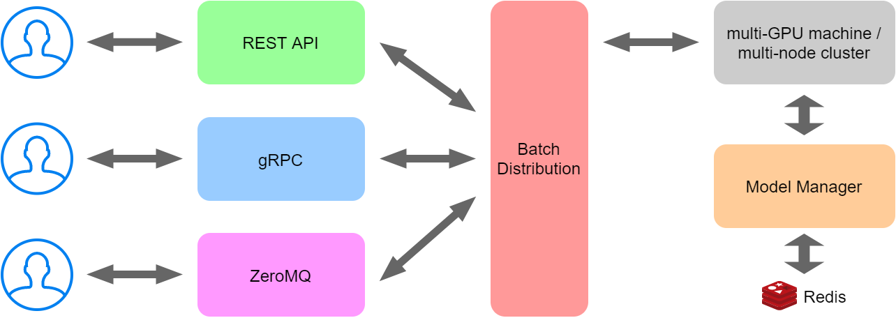
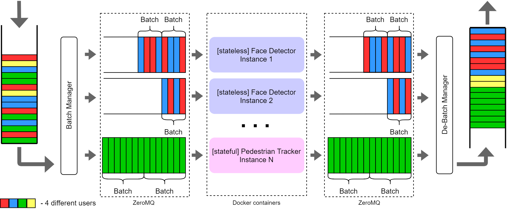
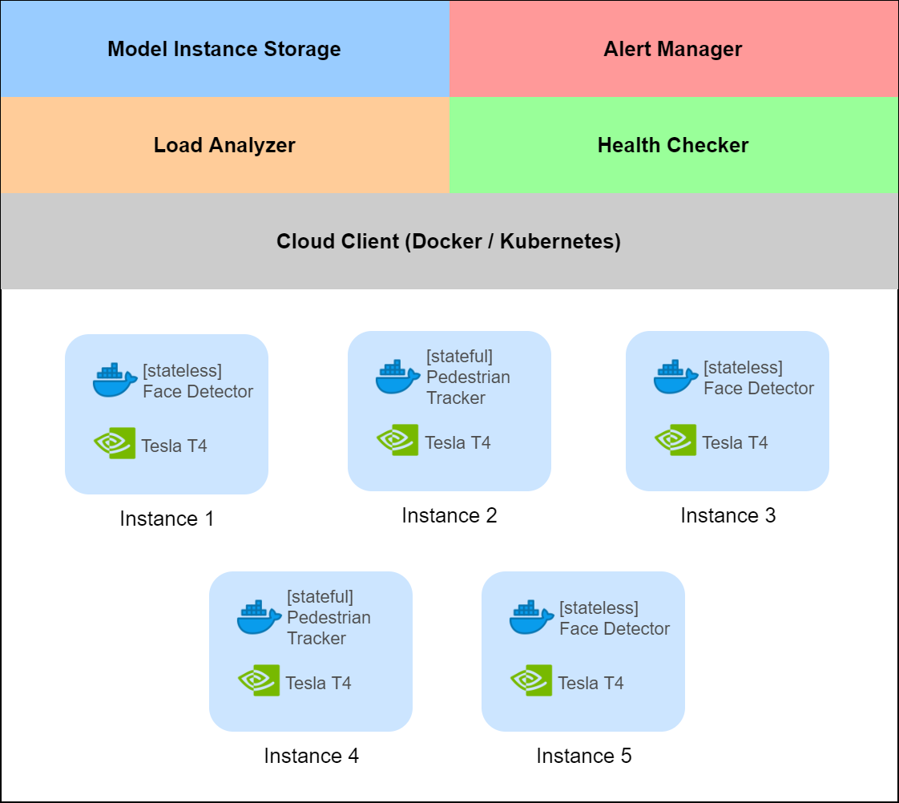

<div align="center">


</div>

## What is it?

Inferoxy is a service for quickly deploying and using dockerized Computer Vision models. 
It's a core of EORA's Computer Vision platform [Vision Hub](https://www.visionhub.ru/) that runs on top of AWS EKS.

## Why use it?

You should use it if:
- You want to simplify deploying Computer Vision models with an appropriate Data Science stack to production: 
  everything you need is to build a Docker image 
  with your model including any pre- and post-processing steps and push it into an accessible registry
- You have only one machine or a cluster for inference (CPU/GPU)
- Automatic batching for multi-GPU/multi-node setup
- Model versioning

## Architecture


Inferoxy is built in the message broking fashion.
- Roughly, it accepts user requests through different interfaces
which we call "bridges". Multiple bridges can run simultaneously. Current supported bridges are REST API, gRPC and 
ZeroMQ
- The requests are carefully split into batches and processed on a single multi-GPU machine or on a multi-node cluster
- The models to be deployed are managed through Model Manager that 
communicates with Redis to store/retrieve models information such as Docker image URL, maximum batch size value, etc.

### Batching


One of the core Inferoxy's features is the batching mechanism.
- For batch processing it's taken into consideration 
that different models can utilize different batch sizes and that some models can process a series of batches 
from a specific user, e.g. for video processing tasks. The latter models are called "stateful" models while models 
which don't depend on user state are called "stateless"
- Multiple copies of the same model can run on different machines while only one copy can run on the same GPU device. 
  So, to increase models efficiency it's recommended to set batch size for models to be as high as possible
- A user of the stateful model reserves the whole copy of the model and releases it when his task is finished.
- Users of the stateless models can use the same copy of the model simultaneously
- Numpy tensors of RGB images with metadata are all going through ZeroMQ to the models and the results are also read 
  from ZeroMQ socket
  
### Cluster management


The cluster management consists of keeping track of the running copies of the models, load analysis, 
health checking and alerting.
#### Load Analyzer
To increase or decrease number of copies of the models the traffic analysis tool is implemented. 
Currently, it has the following set of triggers:

**For stateless models:**
- Up triggers (↑):
  - `0` copies of the requested model is running
  - `drop_rate > T_max`, where `drop_rate` - average time of processing one item of the batches times 
    total number of items in the input queue, `T_max` - configured maximum time value
- Down triggers (↓):
  - `drop_rate > T_min`, where `T_min` - configured minimum time value
  
**For stateful models:**
- Up triggers (↑):
  - `# of sources > # running copies of the requested model`
- Down triggers (↓):
  - `time of last use for source_id > T_max` - in this case either model release or instance stopping happens depending 
    on whether there are incoming requests to this model
    
#### Health Checker
- Monitors the models running on instances through `Cloud Client`
- In case of a fatal error (model's reason): sends a request to output queue through `Alert Manager` to inform the user 
  about the error
- In case of a non-fatal error (infrastructure reason): re-sends the batch back into the input queue through 
  `Alert Manager`
  
#### Alert Manager
- Defines which source to send an alert to
- Can send alerts to channels such as Discord

#### Model Manager
- Stores information about models including links to Docker images in Redis, batch size values, etc.
- Has REST API to add/delete/update models

#### ModelInstanceStorage
- Manages running models
- Receives requests from `Health Checker` when a new model was started or old model was stopped

#### Bridges
- Collection of interfaces to communicate with the outer world. Current supported bridges are: REST API, gRPC, ZeroMQ
- Implement part of 
  [KF serving protocol](https://github.com/kubeflow/kfserving/blob/master/docs/predict-api/v2/required_api.md)
- Easy to add new bridge
- Multiple bridges can run simultaneously

## Requirements
You can run Inferoxy locally on a single machine or [k8s](https://kubernetes.io/) cluster. 
To run Inferoxy, you should have a minimum of **4GB RAM** and CPU or GPU device depending on your speed/cost trade-off. 

## Basic commands

## Local run
To run locally you should use Inferoxy Docker image. The last version you can find 
[here](https://github.com/eora-ai/inferoxy/releases).
```bash
docker pull public.registry.visionhub.ru/inferoxy:v1.0.4
```
After image is pulled we need to make basic configuration using .env file
```env
# .env
CLOUD_CLIENT=docker
TASK_MANAGER_DOCKER_CONFIG_NETWORK=inferoxy
MODEL_STORAGE_DATABASE_HOST=redis
MODEL_STORAGE_DATABASE_PORT=6379
MODEL_STORAGE_DATABASE_NUMBER=0
LOGGING_LEVEL=INFO
```
The next step is to create `inferoxy` Docker network.
```bash
docker network create inferoxy
```
Now we should run Redis in this network. Redis is needed to store information about your models.
```bash
docker run --network redis --name redis redis:latest 
```
Create `models.yaml` file with simple set of models. You can read about `models.yaml` in 
[documentation](https://github.com/eora-ai/inferoxy/wiki)
```yaml
stub:
  address: public.registry.visionhub.ru/models/stub:v5
  batch_size: 256
  run_on_gpu: False
  stateless: True
```

Now we can start Inferoxy:
```bash
docker run --env-file .env.dev 
	-v /var/run/docker.sock:/var/run/docker.sock \
	-p 7787:7787 -p 7788:7788 -p 8000:8000 -p 8698:8698\
	--name inferoxy --rm \
	--network inferoxy \
	-v $(shell pwd)/models.yaml:/etc/inferoxy/models.yaml \
	public.registry.visionhub.ru/inferoxy:${INFEROXY_VERSION}
```

## Documentation

You can find the full documentation [here](https://github.com/eora-ai/inferoxy/wiki)
